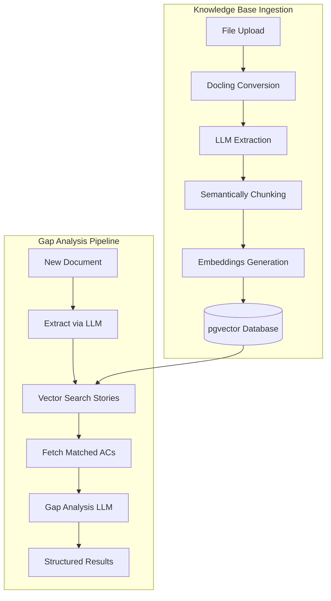

# Architecture

The Doc Gap Analysis system is an advanced RAG (Retrieval-Augmented Generation) pipeline designed to evaluate requirement gaps within unstandardized documents. It intelligently converts complex formats (like PDFs/Word docs) into structured markdown via Docling, extracts granular user stories and acceptance criteria (AC) via an LLM, chunks them semantically, and persistently stores them in a robust pgvector database. During comparison, new unmapped documents are processed similarly, matched contextually against the existing database using vector searches, and analyzed for functional disparities.

## System Flow

## Core Components

| Component | File Path | Description |
|-----------|-----------|-------------|
| FastApi Application | `src/rag_api/app.py` | The main HTTP routing framework containing configured endpoints and exception handlers. |
| Pipeline Orchestrator | `src/rag_ingest/pipeline.py` | Governs the flow converting an unstructured doc into stored logical embeddings iteratively. |
| Document Ingestor | `src/rag_ingest/ingest.py` | Interacts with 'Docling' handling low-level conversion logic rendering valid markdown structures. |
| LLM Extractor | `src/rag_ingest/extractor.py` | Responsible for extracting 'Stories' and 'Acceptance Criteria' JSON reliably from prompt inputs. |
| Vector Store API | `src/rag_ingest/store.py` | Interfaces extensively with PostgreSQL and `pgvector` performing CRUD embedding logic sequentially. |

## Database Schema

**Table: `document_chunks`**

| Column | Type | Description |
|--------|------|-------------|
| `id` | SERIAL | Primary sequence key for the table. |
| `chunk_id` | TEXT | Unique identifier composed of `document_name::chunk_type::index`. (UNIQUE constraint) |
| `chunk_type` | TEXT | Logical partitioning mechanism separating `story` constraints and `criteria` rules. |
| `content` | TEXT | Raw document string payload. |
| `embedding` | vector(1536) | Indexed native `pgvector` multi-dimensional float arrays enabling semantic lookups. |
| `story_id` | TEXT | Relational constraint linking criteria directly to mapped primary user-stories. |
| `metadata` | JSONB | Supplementary tracking fields securely carrying document paths, page references, and similarity stats. |
| `source_path` | TEXT | Originating document file-path used comprehensively for mass deletion logic. |

## Data Flows

**Table: `users`**

| Column | Type | Description |
|--------|------|-------------|
| `id` | SERIAL | Primary sequence key for the table. |
| `user_id` | TEXT | Unique UUID representing the user. (UNIQUE constraint) |
| `username` | TEXT | Unique login name. |
| `password_hash` | TEXT | Bcrypt hashed password. |
| `role` | TEXT | User permission level (`admin` or `user`). |
| `created_at` | TIMESTAMP | Record creation date. |

**Table: `sessions`**

| Column | Type | Description |
|--------|------|-------------|
| `id` | SERIAL | Primary sequence key for the table. |
| `token` | TEXT | Unique session authentication token. (UNIQUE constraint) |
| `user_id` | TEXT | Foreign key linking to the user. |
| `created_at` | TIMESTAMP | Session creation date. |
| `expires_at` | TIMESTAMP | Session expiration date. |

## API Endpoints

- `POST /api/auth/login`: Authenticate and receive session token.
- `POST /api/auth/logout`: Revoke session token.
- `GET /api/auth/me`: Get current authenticated user context.
- `GET /api/knowledge-base`: List knowledge base documents.
- `POST /api/knowledge-base/upload`: Ingest new KB document.
- `DELETE /api/knowledge-base/{fileId}`: Remove KB document.
- `POST /api/documents/upload`: Parse and extract target document (pre-comparison).
- `POST /api/documents/compare`: Full RAG comparison executing map insights.
- `POST /api/chat`: Query the knowledge base conversationally.

## Data Flows

### KB Upload Flow
1. **User triggers upload**: A file is uploaded via `/api/knowledge-base/upload`.
2. **Metadata initialization**: Status starts internally as `processing`. A UUID is assigned.
3. **Docling Conversion**: The pipeline extracts clean unstructured text from the PDF/Word artifact.
4. **LLM Structured Generation**: An LLM (GPT-4o) shapes the text directly recognizing logical user stories.
5. **Document Chunking**: Each user story and mapped acceptance criteria is separately tokenized logically.
6. **Vector Generation**: Text chunks pass through to the embedding model yielding multi-dimensional mappings.
7. **Database Storage**: The `vector` items are transactionally committed to `pgvector` mapping constraints.
8. **Completion**: File status hits `ready`.

### Document Analysis Flow
1. **Request trigger**: A target unmapped file is uploaded through `/api/documents/upload`.
2. **Analysis Extract**: Docling maps the raw document text; LLM normalizes it.
3. **Chunk Mapping**: It's locally tokenized. 
4. **Vector Retrieval**: Top similar 'story' entities inside `pgvector` are retrieved based on embedding distance measurements.
5. **Criteria Joins**: Bound AC elements nested underneath matched stories are gathered directly via queries.
6. **Comparison Engine**: The localized uploaded features mapped heavily against the known features pass into the `Gap Analysis LLM`.
7. **Verdict Execution**: Results generate `match_type` values and actionable insights pointing clearly to lacking structural AC constraints.

### Chat Knowledge Base Flow
1. **User Request**: Conversational question -> `POST /api/chat`.
2. **Vector Retrieval**: Question is embedded -> vector search across all chunk types (`story` and `criteria`).
3. **Context Truncation**: Top 5 best textual snippet hits combined.
4. **LLM Execution**: System bounds instructions prompting context explicitly -> formatted payload mapped to `LLM`.
5. **Result Dispatch**: Extracted generated answer and mapped source document similarities returned to UI.
